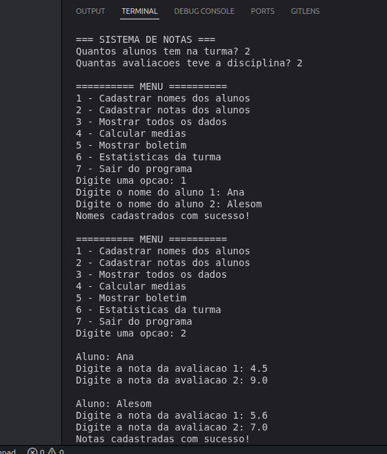
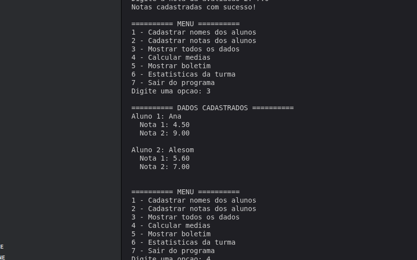
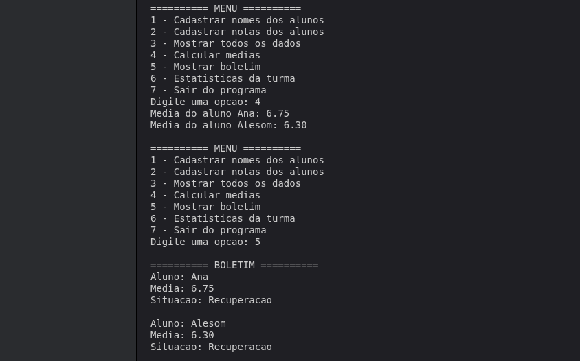
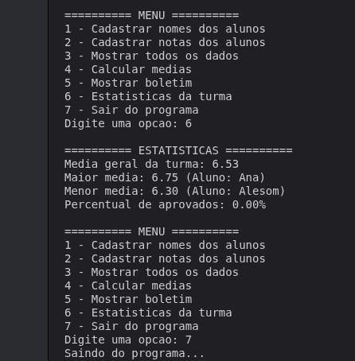

# Diário de Desenvolvimento

- **Componente**: Laboratório de Programação - Turma CX
- **Docente**: Alesom Zorzi
- **Aluna**: Ana Caroline da Luz

---

### Planejamento inicial (15/06/2026)

**Tema:** Sistema de Gerenciamento de Notas em C.

**Funcionalidades:**
- Cadastro de alunos e notas (matriz aluno × avaliação + vetor de nomes)
- Cálculo de médias (vetor de médias)
- Boletim com situação (Aprovado / Recuperação / Reprovado)
- Estatísticas da turma (média geral, maior/menor média, % de aprovados)

**Forma de registro:** este arquivo DIARIO.md, prints da IDE e da execução.

---

### Etapa 1: Configuração do projeto (15/06/2026)

**Objetivo:** organizar a estrutura de trabalho do projeto e seu planejamento.

**Atividades realizadas:**
- Escolha do tema e definição das funções do projeto;
- Criação deste arquivo DIARIO.md.

**Próximos passos:** Etapa 2: Implementar estrutura básica.

---

### Etapa 2: Implementação da estrutura básica (17/06/2026)

**Objetivo:** criar as estruturas de dados e funções básicas do sistema.

**Atividades realizadas:**
- Definição de variáveis globais (matriz de notas, vetor de nomes, vetor de médias);
- Menu interativo com do/while e if/else;
- Função de cadastro de nomes dos alunos;
- Função de cadastro de notas dos alunos;
- Função de exibição dos dados cadastrados;
- Função de cálculo de médias individuais.

**Próximos passos:** Etapa 3: Implementar boletim com situação (Aprovado / Recuperação / Reprovado).

---

### Etapa 3: Boletim e estatísticas (19/06/2026)

**Objetivo:** exibir o boletim com a situação de cada aluno e estatísticas da turma.

**Atividades realizadas:**
- Menu ajustado para incluir opções 5 (Boletim) e 6 (Estatísticas);
- Lógica de situação: Aprovado (média ≥ 7), Recuperação (média ≥ 4), Reprovado (média < 4);
- Cálculo de média geral da turma, maior/menor média e percentual de aprovados;
- Testes manuais com diferentes cenários de notas.

**Problemas encontrados:**
- Ao testar com notas inválidas (acima de 10), o programa aceitava sem alertar. Decidi tratar isso na próxima etapa.

**Próximos passos:** Etapa 4: Modularizar o código com funções e adicionar validações.

---

### Etapa 4: Modularização com funções (22/06/2026)

**Objetivo:** organizar o código em funções com passagem de parâmetros e retorno, trocar if/else por switch, e adicionar validação de notas.

**Atividades realizadas:**
- Criação da função `calcularMedia(float notas[], int qtd)` — recebe o vetor de notas de um aluno e a quantidade de avaliações, retorna a média calculada;
- Criação da função `cadastrarNomes()` para cadastro de alunos;
- Criação da função `cadastrarNotas()` com validação usando while (nota entre 0 e 10);
- Criação da função `mostrarDados()` para exibir os dados;
- Criação da função `calcularTodasMedias()` que chama `calcularMedia()` para cada aluno;
- Criação da função `mostrarBoletim()` para exibir boletim com situação;
- Criação da função `mostrarEstatisticas()` para cálculos da turma;
- Substituição do if/else por switch no menu.

**Próximos passos:** Revisão final do código e preparação para entrega em 26/06.

---

### Etapa 5: Revisão final e testes (23/06/2026)

**Objetivo:** revisar o código, testar o programa e guardar os prints antes da entrega.

**Atividades realizadas:**
- Compilação do programa sem erros;
- Testes com os três casos de situação (Aprovado, Recuperação e Reprovado);
- Teste da validação de nota inválida (acima de 10), resolvendo o problema anotado na Etapa 3;
- Conferência dos cálculos de média, média geral e percentual de aprovados.

**Resultado:** deu tudo certo, o programa está funcionando.

---

## Trechos de código

Função que calcula a média de um aluno. Ela recebe o vetor de notas e a quantidade de avaliações e devolve a média:

```c
float calcularMedia(float notas[], int qtd) {
    float soma = 0;
    int i;
    for (i = 0; i < qtd; i++) {
        soma = soma + notas[i];
    }
    return soma / qtd;
}
```

Parte que valida a nota com while, pra não deixar cadastrar um valor fora de 0 a 10:

```c
scanf("%f", &notasDosAlunos[i][j]);
while (notasDosAlunos[i][j] < 0 || notasDosAlunos[i][j] > 10) {
    printf("Nota invalida! Digite um valor entre 0 e 10: ");
    scanf("%f", &notasDosAlunos[i][j]);
}
```

---

## Testes

3 alunos, 2 avaliações. A nota 15 foi digitada de propósito para testar a validação.

```
=== SISTEMA DE NOTAS ===
Quantos alunos tem na turma? 3
Quantas avaliacoes teve a disciplina? 2

========== MENU ==========
1 - Cadastrar nomes dos alunos
...
Digite uma opcao: 1
Digite o nome do aluno 1: Ana
Digite o nome do aluno 2: Beto
Digite o nome do aluno 3: Caio
Nomes cadastrados com sucesso!

Digite uma opcao: 2

Aluno: Ana
Digite a nota da avaliacao 1: 15
Nota invalida! Digite um valor entre 0 e 10: 8
Digite a nota da avaliacao 2: 7

Aluno: Beto
Digite a nota da avaliacao 1: 5
Digite a nota da avaliacao 2: 3

Aluno: Caio
Digite a nota da avaliacao 1: 2
Digite a nota da avaliacao 2: 1
Notas cadastradas com sucesso!

Digite uma opcao: 4
Media do aluno Ana: 7.50
Media do aluno Beto: 4.00
Media do aluno Caio: 1.50

Digite uma opcao: 5
========== BOLETIM ==========
Aluno: Ana
Media: 7.50
Situacao: Aprovado

Aluno: Beto
Media: 4.00
Situacao: Recuperacao

Aluno: Caio
Media: 1.50
Situacao: Reprovado

Digite uma opcao: 6
========== ESTATISTICAS ==========
Media geral da turma: 4.33
Maior media: 7.50 (Aluno: Ana)
Menor media: 1.50 (Aluno: Caio)
Percentual de aprovados: 33.33%

Digite uma opcao: 7
Saindo do programa...
```

**Prints da execução:**

Cadastro dos alunos e das notas:



Dados cadastrados:



Médias e boletim com a situação de cada aluno:



Estatísticas da turma:


